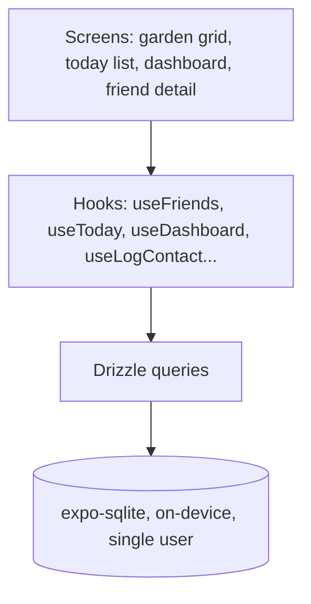
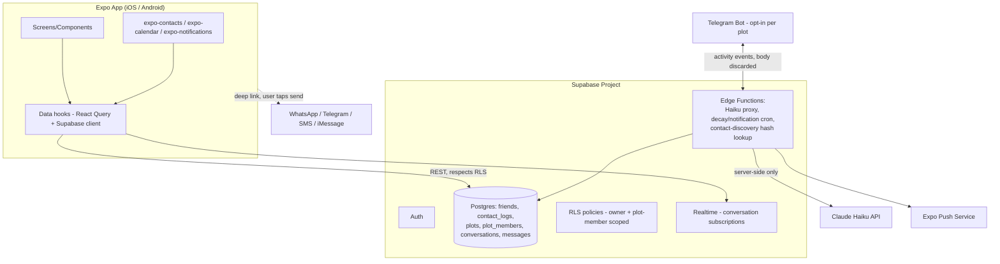

# Friend Garden Roadmap

> **Vision** — A gamified CRM: friends are plants in your community garden plot, and staying in touch is "watering" them. Neglect a plant long enough and it wilts; neglect the whole garden and Private Equity bulldozes it into a McDonald's/Taco Bell/Chick-fil-A hybrid. Mechanically it's a cross of Animal Crossing (visiting others' spaces), Harvest Moon (tending/growth loop), and a CRM (tracking real relationships) — with light AI-generated flavor text (Claude Haiku) and, eventually, network-science-driven insight into friend-group structure.

---

## Target Users

Four persona-driven user stories anchor prioritization — every feature below should trace back to at least one of these.

1. **The overwhelmed networker** — more friend groups/contacts than they can track manually; wants a high-level view of their whole network, an incentive to keep important communities healthy, and to be caught before 6–12 months of silence with someone important or an accidental drift out of a group. Wants the experience to feel rewarding (a dopamine hit), with a fun, beautiful storyline — not a chore.
   - Served today by: dashboard + tag breakdown (the current "high-level view"), plot-level decay (T3-6) for group drift, the decay engine (T2-4) for the 6–12-month silent-failure case, and the garden/watering/Private-Equity-takeover narrative for the dopamine/story hook.
   - Gap: none of the above is actually a *network* view — it's a list. T4-2 computes centrality/community structure but nothing consumes it visually yet. Added **T4-7** below.
2. **The isolated single-threader** — few friends, forgets to reach out, especially across distance. This is the base case the whole app already targets — garden grid, today list, cadence-based decay, push notifications. No gap; this persona is why the core loop exists.
3. **The group-chat keeper** — wants the app to prod (even good-naturedly shame) a whole friend group into keeping the chat/friendship alive.
   - Served today by: plots (T3-1), group decay + fan-out nudge (T3-6), in-app chat or Telegram bridge (T3-2/T4-1).
   - Gap: the Haiku-drafted nudge copy (T2-5) was scoped as one generic tone. This persona specifically wants playful/roasting energy, which won't suit every group. Expanded T2-5 below to include a tone setting.
4. **The relationship-skills learner** — neurodiverse, socially awkward, or simply never taught how to maintain friendships or express care; needs the app to actively help, not just remind.
   - Served today by: T2-5's icebreaker drafting, partially.
   - Gap: T2-5 was scoped narrowly as "reach-out icebreaker text." This persona needs more — lightweight guidance on what to ask about or how to check in — which depends on the `notes` feature (currently just a UI stub, `NotesTabStub`) actually capturing relationship context. Expanded T2-5 and added a real notes ticket below.

---

## Architecture

### Current (v0 — local-only prototype)

No backend, no auth, no network calls of any kind. Everything — data, notifications (local only, birthdays), business logic — lives on one device for one user. This is a fully working solo loop; it's just not multi-user yet.

### Target (multi-user, Supabase-backed)

Release pipeline (both states, unaffected by backend choice): **EAS Build + EAS Submit** → TestFlight / Play internal testing track.

---

## Migration Impact: What Survives vs. What Gets Replaced

A file-level answer to "is this worth touching/learning right now, or is it getting torn out under T1-2/T1-5?" — written from the current tree, not the target diagram, so it stays concrete. Update this list as files move; it'll drift otherwise.

**Keep as-is — no persistence coupling, survives the backend swap untouched:**
- `src/lib/health.ts`, `streak.ts`, `filters.ts`, `today.ts`, `dashboard.ts` + their `*.test.ts` files — pure functions, the intentional swappable-persistence boundary described in CLAUDE.md's Architecture section. This is *why* T1-5 is scoped as "rewire hooks" and not "rewrite business logic."
- `src/lib/constants.ts`, `src/lib/time.ts` — plain helpers, no DB import.
- `src/constants/theme.ts` and everything under `src/components/**` (`FriendCard`, `GardenGrid`, `FilterBar`, `Dashboard` + its subcomponents, `TodayList`/`TodayListItem`, `HealthBadge`, `WaterButton`/`WaterSplash`, `UndoToast`, `PersonTabBar`, `OverviewTab`, `SettingsTab`, `ContactLogList`, `themed-text`/`themed-view`) — presentation only, no direct `db` import anywhere in this tree. T1-5 is explicitly scoped to keep hook *return shapes* stable so this layer "barely notices" the backend swap.
- `src/hooks/use-color-scheme*.ts`, `use-theme.ts` — unrelated to data, not part of this migration at all.
- `src/app/**` route files — the Expo Router shell survives; T1-4 adds `(auth)`/`(app)` route groups around it, it doesn't replace it.

**Keep the name/shape, replace the internals — these are T1-5's actual work:**
- `useFriends`, `useFriend`, `useArchivedFriends`, `useArchiveFriend`, `useLogContact`, `useUpdateFriend`, `useDashboard`, `useToday`, `useStreak` — each currently imports straight from `src/db/queries/*` and hand-rolls its own `useState`/`useEffect`/`useFocusEffect` loading logic (see `src/hooks/useFriends.ts`). Per CLAUDE.md, hooks should never call the backend directly at all once T1-5 lands — they'll call `src/api/*.ts` and layer React Query on top. Today's version is the correct v0 shape, not a mistake to avoid repeating; it just doesn't survive T1-5.
- `src/store/useGardenStore.ts`'s `version`/`bump()` mechanism — currently the only cache-invalidation strategy in the app (`useFriends` refetches when `version` changes, bumped after writes). React Query's own invalidation replaces this need; the store itself can stay for genuinely ephemeral UI state, but this particular counter is very likely dead code once T1-5 lands, not a pattern to extend further in the meantime.

**Remove outright — SQLite/local-only, no equivalent survives the swap:**
- `src/db/client.ts` (`expo-sqlite` + `drizzle-orm/expo-sqlite`) — replaced by the Supabase JS client, itself only ever called from inside `src/api/*.ts` per the "backend code is never called directly by the client" rule.
- `src/db/schema.ts` — SQLite table defs; replaced by the Postgres schema in T1-2 (different dialect, added columns like `owner_id`/`friend_user_id`, new tables). Not a port — a rewrite against the target schema in T1-2's ticket text.
- `src/db/queries/friends.ts`, `src/db/queries/contactLogs.ts` — direct Drizzle-over-SQLite queries called straight from hooks; this whole pattern is what T1-5's thin `src/api/*.ts` layer replaces.
- `src/db/seed.ts` — local SQLite dev-seed script; local Supabase (Docker) uses its own seeding convention (`supabase/seed.sql` or an API-driven script), not a port of this file.
- root `drizzle.config.ts` (`dialect: 'sqlite', driver: 'expo'`) — replaced by T1-2's Postgres config (`dialect: 'postgresql'`, generate-only, never applied directly per the migration-tooling rule in System Design Notes).

**Undecided — don't delete or extend casually:**
- `src/lib/birthdayNotifications.ts` (+ test) — T2-4's ticket text already flags this as an open question (does the server-side decay engine subsume on-device birthday notifications, or stay separate?). Leave it alone until that's actually decided when T2-4 is built.
- `src/components/person/NotesTabStub.tsx` — explicitly named in T2-6 as the stub to replace with real guided-notes functionality; don't build more on top of the stub in the meantime.

---

## Completed

- [x] Expo Router app shell (SDK 54, typed routes, React 19, Reanimated 4)
- [x] Local SQLite schema via Drizzle (`friends`, `contactLogs`, `notes`, `meta`)
- [x] Garden grid, today list, dashboard (health summary, activity feed, tag breakdown), friend detail tabs, archive view
- [x] Health/decay scoring, streaks, filters, today-list derivation — pure functions in `src/lib/`, all with Jest tests
- [x] Water button + splash animation (the core "log contact" interaction)
- [x] Local birthday notifications (`expo-notifications`, on-device only)
- [x] Architecture design pass — target schema, integration boundaries, and release pipeline agreed (this doc)

---

## External Integration Strategy

Every integration in this roadmap talks to something we don't control, so it's worth ranking them explicitly by two criteria — **importance** (how load-bearing it is to the product actually working) and **maintenance burden** (ongoing upkeep independent of anything we build) — rather than treating "external integration" as one uniform category.

| Integration | Importance | Maintenance burden | Notes |
|---|---|---|---|
| Claude Haiku (Anthropic) | Highest — the signature differentiator (tone-aware nudges, icebreakers, relationship guidance) | Medium — periodic model-deprecation cycles need occasional model-ID updates, standard for any LLM API | Core to personas 3/4 |
| Expo Push | Highest in practice — the core reminder/decay loop doesn't function at all without it, arguably as load-bearing as Haiku even though Haiku leads by stated priority | Medium — reliable, but it's a dependency layer between us and APNs/FCM worth knowing exists | |
| Contacts (`expo-contacts`) | High — onboarding/friend-adding, prerequisite for Calendar matching and discovery | Low — stable OS-level API, only touched incidentally by routine Expo SDK upgrades | |
| Calendar (`expo-calendar`) | Medium-high — passive health signal + connection confirmation | Low — same stable OS-API profile as Contacts | Weaker before Contacts ships (needs friend emails to match against), a soft ordering not a hard blocker — manual email entry works too |
| Contact-discovery hash lookup | Medium — growth/UX nicety (know a contact's already on the app), not core CRM function | Low-medium — pepper/rate-limit infra to build once, stable after | Depends on Contacts |
| Messaging hand-off (WhatsApp/Telegram/SMS/iMessage deep links) | Medium — valuable assist, but genuinely optional (manually texting someone outside the app still works) | Low — stable public URL schemes, vendors have their own incentive to keep them stable | |
| Telegram Bot bridge | Lowest — niche, opt-in, deferred | Highest — an actual bot account to manage, webhook reliability to monitor, its own API evolution over time | Correctly Tier 4; this is *why*, not just incidental |

(Friend-code/QR, T4-9, isn't on this list — it has no external dependency at all, it's purely our own generated code + camera scan.)

**Two operational principles this implies:**

- **Independent integration calls run in parallel, never serially, both at runtime and in how work gets built.** At runtime: when a single action triggers multiple independent external calls — e.g. "Reach Out" (T3-4) calling Haiku for a drafted message *and* probing which messaging apps are installed — these don't depend on each other's results and should be issued concurrently (`Promise.all`), not awaited one after another; sequential awaiting pays the latency cost of every call added together instead of just the slowest one. In development: since most integrations here are independent of each other (the only real data dependencies are Calendar/discovery on Contacts having shipped first, noted in the table above), there's no reason to build them strictly one-at-a-time — with two contributors, independent integrations are naturally parallelizable work.
- **Each integration fails independently, never cascades.** If Haiku errors, "Reach Out" should still let someone pick a channel and type their own message rather than blocking the whole flow; if Calendar sync fails, it shouldn't affect core watering. This is the same graceful-degradation principle used for cross-client-version compatibility, just applied to external dependencies instead of peer app versions.

---

## Prioritized Backlog

**File position is the intended work order; ticket IDs are stable identifiers assigned at creation and are not resequenced when new tickets are inserted.** When something is deliberately placed out of numeric sequence for a non-obvious reason, say so inline (matching CrowdSync's convention) — don't rely on the number alone to convey priority.

Ordered around the current goal: **stand up the multi-user backend without losing the working solo loop**, then layer in the social/accountability features that make "Friend Garden" more than a personal habit tracker.

### Tier 1 — Backend bootstrap (blocks everything below)

- [ ] **T1-1. Supabase project + environment setup** — Supabase CLI local stack (Docker) for day-to-day schema iteration; one hosted Supabase project for now, shared during dev and by TestFlight/Play beta testers. Branch-based deploy: PRs merge into `main`, a GitHub Action (`supabase/setup-cli` + `supabase link` + `supabase db push` + `supabase functions deploy`, migrations step before functions step) triggers on push to `main` and applies committed migrations *and* Edge Functions to the shared hosted project — this is functionally "staging" already, even before a second environment exists. The same job also pushes runtime secrets (`ANTHROPIC_API_KEY`, later `TELEGRAM_BOT_TOKEN`) from GitHub Actions secrets to Supabase via `supabase secrets set`, so secret rotation is a documented CI step, not a CLI incantation someone has to remember. Use GitHub **Environments** (not hardcoded secrets in the workflow) to hold `SUPABASE_PROJECT_REF`/`SUPABASE_DB_PASSWORD`/function secrets per environment, so adding the second environment later is additive, not a rewrite.
- [ ] **T1-1b. Release branch + production Supabase project** *(do once past beta, not now)* — create a `release` branch and a second hosted Supabase project; add a `production` GitHub Environment with its own secrets; the existing workflow's branch condition (already written to route `release` → `production`, `main` → `staging`) starts applying with no changes needed. At this point `main`'s deployment is explicitly "staging" in both name and function. Consider extending the same branch to trigger an EAS production build/submit (T1-6) at the same time, so "cut a release" becomes one merge.
- [ ] **T1-2. Target Postgres schema — hybrid Drizzle + SQL migrations** — `friends` (add `owner_id`, `friend_user_id` nullable, keep existing fields — `phone`/`email` already modeled, a head start for T2), `plots`, `plot_members`, `conversations`, `conversation_members`, `messages`, `profiles` (own account, signup trigger, `timezone` IANA name for T2-4's scheduling), `push_tokens` (keyed by token, not by user — supports multi-device, includes `last_seen_at`), `identifier_lookup` (service-role only, backs T2-2), `blocks`/`reports` (T3-0), `nudges` (sender/recipient/timestamp — backs both T3-3's confirmation logic and its rate limit), `haiku_usage_log` (user_id/timestamp — backs T2-5's rate limit). No standalone `friend_edges` table — see System Design Notes on why the friend-graph is computed, not stored. Drizzle (`dialect: 'postgresql'`) is schema-definition/type-generation only — never let `drizzle-kit push`/`migrate` apply to the DB directly. Generate SQL (`drizzle-kit generate`), commit it into `supabase/migrations/`, and apply exclusively via `supabase db push`. This keeps Supabase's own migration history the single system of record (so branching/CI keep working natively as the project scales) while still getting a readable current-state schema file and compile-time query safety day to day.
- [ ] **T1-3. RLS policies** — `owner_id = auth.uid()` directly on tables that carry their own `owner_id` (`friends`, `push_tokens`); `contact_logs`/`notes` carry only `friend_id`, not their own `owner_id` (see T1-2), so their policy is `EXISTS (SELECT 1 FROM friends WHERE friends.id = contact_logs.friend_id AND friends.owner_id = auth.uid())` — same join-through-`friends` idiom as the membership-table checks below, not a denormalized column. `EXISTS`-against-membership-table on shared tables (`plots`/`plot_members`, `conversations`/`conversation_members`/`messages`) via `plot_members`/`conversation_members`. **`profiles`**: write restricted to owner (`id = auth.uid()`); **read is relationship-scoped, not open to every authenticated user** — an `EXISTS` check against `friends.friend_user_id` (anyone who has you as an app-linked friend, one-directional — no reciprocity required) OR shared `plot_members`. Never a blanket "any authenticated user can read any profile" policy — that would let any registered stranger enumerate every user's display name/avatar with zero relationship to them, which matters more than usual here since even *being* a Friend Garden user is mildly sensitive information about someone's relationships. **`identifier_lookup`**: RLS enabled with **zero** policies for `anon`/`authenticated` — that omission (not a policy naming service_role) is itself the correct control, since `service_role` bypasses RLS entirely regardless, but a table where RLS was never enabled at all is openly exposed via Supabase's auto-generated API by default. **Standing rule going forward**: every new table gets RLS enabled in the same migration that creates it, before any policy is written — never a follow-up step. No client ever gets service-role access.
- [ ] **T1-8. Edge Functions scaffolding** — one function per concern (`supabase/functions/haiku-proxy`, `decay-engine`, `contact-discovery`, later `telegram-webhook`), Supabase's standard layout, with a `_shared/` module for common code (CORS headers, Supabase client init, shared types). Each function's runtime only gets the secrets it actually needs (e.g. `haiku-proxy` never sees the service-role key `decay-engine` uses) — smaller blast radius than one monolithic routed function, plus independent logs/deploy/rollback per concern. Blocks T2-2, T2-4, T2-5 (each is one of these functions).
- [ ] **T1-4. Supabase Auth + onboarding flow** — email/password only to start (simplest, sidesteps Apple's Sign-in-with-Apple equal-treatment requirement entirely since no competing social login is offered). Session persistence via `expo-secure-store`, not `AsyncStorage`. Auth-gated routing via Expo Router route groups — `(auth)` for login/signup, `(app)` for the authenticated app, root `_layout.tsx` redirects based on session state (currently has no auth concept at all). This composes naturally with deep links (push notification → friend detail, via Expo Router's automatic file-based linking — no separate deep-link config needed): an unauthenticated deep link redirects to login and resumes after. Add Sign in with Apple before a full public App Store submission; only add Google alongside Apple, never alone on iOS (App Store Guideline 4.8).
- [ ] **T1-5. Rewire hooks to Supabase, preserve interfaces, via a thin API layer** — hooks (`useFriends`, `useToday`, `useDashboard`, `useLogContact`, `useArchiveFriend`, `useUpdateFriend`, `useStreak`) never call `supabase-js` directly. Instead, a thin typed layer (`src/api/friends.ts`, `src/api/contactLogs.ts`, etc., built on `supabase gen types typescript`) encodes each table's actual query shape and implicit rules (e.g. "exclude archived unless requested") in one place; hooks call these functions and layer React Query on top for caching/loading/error state. Keep each hook's *return shape* stable so `src/components/**` needs minimal changes — the whole point of this tier is that the UI layer barely notices. The API layer is also the natural mock boundary if hook-level tests are added later.
- [ ] **T1-6. EAS Build & Submit setup** — `eas.json` profiles (development/preview/production), bundle identifiers, signing, App Store Connect + Play Console wiring. Independent of the backend work — can happen in parallel, and gets a build in front of testers early even before T1-1–T1-5 land.
- [ ] **T1-10. Privacy policy + minimal public site** — a small static page (Cloudflare Pages, same hosting pattern as CrowdSync's frontend) disclosing data handling, including the third-party personal data the app facilitates collecting (contacts imported for matching, calendar attendee matching, and eventually notes about friends' personal circumstances — see T2-6). Both App Store Connect and Play Console require a privacy policy URL as part of setting up testing tracks, likely before TestFlight/Play beta distribution even works, not just before public release — treat as blocking, not deferred. Also the eventual host for T3-5's universal-links fallback page. *(Placed right after T1-6 — both are store-submission prerequisites, worth doing together.)*
- [ ] **T1-7. Local→remote data migration path** — one-time script to read a device's existing SQLite rows and seed them into Supabase under that user's new account, so nobody testing today loses their garden.
- [ ] **T1-9. Offline UX** — online-required with cached last-known reads, not full offline-first: rely on React Query's default cache-while-revalidating behavior (near-free once T1-5 lands) plus a `NetInfo`-driven offline indicator. Writes (the Water button, etc.) fail with a clear "you're offline" message rather than silently queuing. Full offline-first (write queue, conflict resolution) is explicitly deferred — disproportionate engineering for this app's actual usage pattern (a habit-tracker check-in isn't moment-critical the way live chat mid-conversation would be); revisit only if real beta usage shows testers are frequently offline.
- [ ] **T1-11. Minimum-supported-version gate** — a `min_supported_version` value (a simple config row, or a tiny Edge Function) checked on app launch against the installed version (`expo-constants`); below the minimum shows a blocking "please update" screen with a store link. The practical lever for retiring old-client behavior on our own schedule — the backend deploys independently of any individual client's update cadence (every merge to `main` ships immediately), so multiple app versions talking to one backend is the constant state of the system, not a rare edge case.
- [ ] **T1-12. Per-integration kill switches** — extend T1-11's config mechanism with flags (`haiku_enabled`, `telegram_bridge_enabled`, `calendar_sync_enabled`, etc.) checked by Edge Functions/client before invoking each external dependency. Lets a misbehaving integration (a cost spike, a vendor API change) be disabled server-side instantly, without waiting on an app-store release.

### Tier 2 — Core CRM parity + native integrations

- [ ] **T2-1. Contacts import (`expo-contacts`)** — a **selection UI, not all-or-nothing**: the user picks which specific contacts to bring in from a picker; **zero selected is a fully valid, first-class path**, never a forced minimum or an onboarding blocker. Only selected contacts' phone/email feed T2-2's discovery and become `friends` rows — this is what makes T2-2's data-minimization scoping (never process contacts that weren't being added) actually hold in practice. **A manual "add a friend" flow must exist independent of this import step** — for someone not in the phone's contacts, for anyone who skips import entirely, or for adding a friend later. Not a net-new capability so much as a "don't regress" requirement: the current local-only app already only supports manual adding today. Primary source of `phone`/`email`, which both T2-2 and messaging hand-off (T3) depend on.
- [ ] **T2-2. Contact-discovery hash lookup** — Edge Function receives normalized phone/email (E.164 for phone) over TLS and immediately computes `HMAC-SHA256(value, server_secret_pepper)` — the pepper is server-only secret material (via the T1-8/B2 secrets pipeline), never derived from the contact itself, since nothing in a contact record (name, etc.) can add real entropy without breaking matching (both sides must independently converge on the identical canonical value — see discussion below). Only the HMAC output is persisted in/compared against `identifier_lookup`; raw values are never persisted or logged, only processed transiently in memory during the request. Phone and email are checked as **independent lookups**, never combined into one hash (most contacts only have one or the other). **Rate-limited per user**, and **scoped to contacts actively being added as friends**, not a bulk dump of the entire imported address book — this also addresses data-minimization (never process contact info for people who were never going to be added). Populates `friend_user_id` on a match.
- [ ] **T2-3. Calendar integration (`expo-calendar`)** — on-device EventKit/CalendarContract read, periodic sync on app open/background, match event attendees against friend emails, feed matches into the decay engine as a real "contact occurred" signal. Depends on T2-1 for emails to match against. Dual-purpose: also serves as a passive, channel-agnostic connection-confirmation signal after a reach-out (T3-4/T3-3) — a subsequent calendar event with that friend is strong independent evidence contact happened, regardless of which channel was used.
- [ ] **T2-4. Server-side decay/notification engine** — Edge Function computing per-friend inactivity and firing Expo push notifications on threshold crossings, triggered **hourly** via `pg_cron`/`pg_net` (versioned in a migration, not GitHub Actions cron — keeps the trigger inside Supabase with no external caller needing credentials, and avoids GitHub Actions' scheduled-workflow timing slop). **Timezone-aware batching**: `profiles.timezone` (IANA name, captured client-side via `Intl.DateTimeFormat().resolvedOptions().timeZone`, refreshed on app open) determines which users a given hourly run processes — only those whose current local hour (via Postgres's native `now() AT TIME ZONE profiles.timezone`) falls in the target delivery window (tunable; e.g. ~8am local). This both avoids notifying someone at 3am local and naturally shards the workload into ~24 time-of-day slices instead of one nightly batch, substantially raising the scale at which the deferred dispatcher/worker split (T4-10) would actually become necessary. **Idempotent by design**: notify only on a *state transition* (health just crossed into wilting since the last recorded check, tracked via a persisted last-known-health field), not "is health currently bad" — a retried or duplicate run can never double-notify. **Batched sends**: push notifications go out via Expo's push API in batches of up to 100 per request (its own documented recommendation), not one call per friend. **Visibility**: each run writes a summary row (timestamp, friends processed, notifications sent, errors) so a partial/failed run is a visible fact, not silent. **Push token hygiene**: each hourly run's first step checks Expo delivery receipts from ~1-2 runs ago (receipts aren't ready immediately) and deletes any `push_tokens` row that comes back `DeviceNotRegistered` — no new schedule needed, piggybacked on the existing cron cadence. Paired with the client re-registering its token (upsert by token, not by user) on every app open/foreground, which self-heals the common case (rotated token) before it ever causes a missed notification; the receipt check catches the case that can't self-heal (device gone for good, app never opens again). **Open question, not yet decided** (see `USER_FLOWS.md` Phase 2): whether this replaces/extends the current local-only birthday notifications (`expo-notifications`, on-device) or that mechanism stays separate — don't assume consolidation when building this.
- [ ] **T2-5. Claude Haiku via Edge Function** — flavor text and drafted icebreaker messages, called only server-side; API key never touches the client. Scope includes: (a) a per-plot/per-friend **tone setting** (gentle vs. playful/roast) for nudge and hand-off copy — a "college boys" group chat and a quietly-drifting long-distance friendship want very different energy; (b) light **relationship-maintenance guidance** alongside icebreaker drafts (what to ask about, how to check in) for users who want more help than a reminder — depends on T2-6 having real notes content to draw on. **Rate-limited via `haiku_usage_log`**: a per-user daily cap (this is real per-call money, and the feature is user-triggered on demand with no natural ceiling otherwise), plus a coarse global daily budget alert (not a hard cap, just a log/notification if total spend crosses a threshold) as a cheap safety net against a client-side bug hammering the endpoint rather than genuine abuse. Same simple Postgres-count approach as T3-3 — no separate rate-limiting infra.
- [ ] **T2-6. Guided notes / relationship-context prompts** — replace the current `NotesTabStub` with real functionality: structured prompts (what's going on in their life, what they need support with) rather than a bare free-text box. Directly serves users who don't intuitively know what to check in about; also the context T2-5's guidance drafts read from. **Handle with care**: this captures sensitive personal information about real third parties (health, relationship struggles) who never consented to being tracked and aren't Friend Garden users. Prompt wording should invite general context ("what's going on with them lately") rather than explicitly soliciting special categories (health/mental-health diagnoses, etc.) — can't prevent a free-text field from containing anything, but shouldn't actively encourage it either. Must be covered by T2-7's deletion cascade and disclosed in T1-10's privacy policy.
- [ ] **T2-7. Account deletion** — in-app, per Apple App Store Guideline 5.1.1(v) (any app supporting account creation must support in-app account deletion, not just deactivation) — timing relative to beta review isn't fully certain, but safest to build before public submission at the latest, and worth having early once real user data exists. Cascades through purely-personal data (`friends`, `contact_logs`, `notes`, owned `plots`) as a hard delete. **Needs actual design for shared data**: `messages` a deleted user sent in a still-active plot conversation shouldn't corrupt other members' history — anonymize the sender ("Deleted User") rather than removing their messages entirely, the common pattern other chat apps use, rather than a naive cascading delete.

### Tier 3 — Social & accountability layer

- [ ] **T3-0. Blocks + reports (cross-cutting — blocks T3-2, T3-3)** — `blocks` (`blocker_id`, `blocked_id`, owner-scoped RLS) and `reports` (reporter, reported user/message, reason, status — a moderation record, reviewed manually via Supabase Studio at this scale, no dashboard/automation needed yet). Enforced everywhere two accounts interact in-app: nudges (T3-3) check a **symmetric** block (either direction disables it — "I blocked them" and "they blocked me" both count) before sending; 1:1 chat (T3-2) disallows messaging entirely between a blocked pair; group/plot chat can't structurally remove a blocked member from a shared group, so a block there means client-side hiding of that member's messages from the blocking user's view, not a hard prevention. Deliberately independent of `friends.archived` — archiving is private CRM bookkeeping, blocking is an account-to-account safety control; don't conflate them. Doesn't touch external messaging hand-off (T3-4) at all, since Friend Garden isn't the channel there.
- [ ] **T3-1. Plots (mutual-friend groups)** — `plots`/`plot_members`, UI to create a group from friends who are all connected to each other.
- [ ] **T3-2. Unified conversations** — `conversations`/`conversation_members`/`messages` covering both 1:1 (plant) and group (plot) chat with the same RLS pattern as everywhere else; `react-native-gifted-chat` for the UI. **Realtime delivery uses explicit Broadcast + Realtime Authorization (RLS on `realtime.messages` scoping subscription to a `conversation:<id>` channel via the same `EXISTS`-against-`conversation_members` check), not implicit Postgres Changes RLS filtering** — Postgres Changes' automatic RLS behavior has real rough edges (DELETE events especially) and has shifted across Supabase versions; explicit channel-subscription authorization is auditable with the same idiom already used elsewhere, rather than trusting an assumption about realtime-layer behavior. Verify the exact current API shape against Supabase's docs when this is built. Respects T3-0's blocks (1:1 conversations with a blocked pair are disallowed entirely; a blocked member's messages in a shared/group conversation are hidden client-side) and surfaces report — required for App Store review on any UGC chat surface.
- [ ] **T3-3. In-app "nudge"** — lightweight one-way (or short two-way) push between two Friend Garden accounts, no chat UI required; ships ahead of T3-2 as the low-friction default whenever a friend is an app user, and doubles as the stepping stone toward full chat. **Confirmation is fully automatic and requires no user prompt**: both people are on the platform, so if the recipient logs a contact (`contact_logs` insert or a nudge back) toward the sender within a window (e.g. 72h) of receiving a nudge, that's real bidirectional evidence and resets both sides' decay timers — no manual "did you connect?" needed for this path at all. Checks T3-0's blocks (symmetric — either direction) before sending; a blocked pair never sees a nudge option for each other. **Rate-limited via the `nudges` table**: a per-pair cooldown (e.g. one nudge per 24h between the same two people — blocking isn't the right tool for "annoying but not malicious," and unlimited nudging directly works against the app's own "low-friction, feel-good" goal) plus a per-sender daily cap across all recipients (catches mass-nudge spam, a different failure mode than pestering one friend). A simple Postgres count/timestamp check in the Edge Function — no separate rate-limiting service needed at this scale.
- [ ] **T3-4. Messaging hand-off** — deep-link compose to WhatsApp/Telegram/SMS/iMessage prefilled with a drafted message; installed-app probing (`LSApplicationQueriesSchemes` / Android `<queries>`); universal clipboard-copy fallback for gaps (e.g. WhatsApp can't target an existing group). **Confirmation, layered by what's actually available per channel, no manual prompt as the default**: (1) iOS SMS/iMessage via `MFMessageComposeViewController` returns a real `.sent`/`.cancelled`/`.failed` result to the app — use `.sent` as an automatic signal, no prompt needed; (2) WhatsApp/Telegram deep-link and clipboard-copy give no such callback, so default-assume success when `AppState` shows the user returned to the app within a short window (e.g. 2 minutes) of backgrounding for the hand-off (this is app-foreground tracking, not deep linking — a distinct mechanism from how push notifications or invite links route into the app), surfaced as a quiet, dismissible "marked as reached out — tap if that's not right" affordance rather than a blocking confirm dialog; (3) a subsequent Calendar match (T2-3) independently corroborates any channel after the fact. A blocking manual prompt is a last resort only, not the primary mechanism for any channel. **The Haiku call and the installed-app probe are independent of each other and run concurrently (`Promise.all`), not sequentially** — see External Integration Strategy above.
- [ ] **T3-5. Invite loop** — append an invite link to hand-off messages sent to non-app-user contacts, converting them into the cheaper in-app-nudge path over time. **Open question, not yet resolved**: the app's deep-linking approach (see System Design Notes' "Frontend structure, resolved" below) was deliberately kept to Expo Router's automatic file-based linking for in-app navigation, with no universal-links (`https://`) setup — but a bare `friendgarden://` custom-scheme link does nothing for someone who doesn't have the app installed yet, which is exactly who an invite link targets. Needs a real decision when this ticket is actually built: universal links with a web fallback page (piggybacking on whatever small site ends up hosting the privacy policy), a plain app-store link with no deferred-deep-link resume, or something else.
- [ ] **T3-6. Group-level inactivity + fan-out nudge** — extend the decay engine (T2-4) to detect whole-plot silence and notify all members at once.

### Tier 4 — Advanced / deferred

- [ ] **T4-6. More seamless sign-in methods** — magic link, phone OTP, and/or Sign in with Apple/Google layered on top of email/password once real friction from testers justifies the setup cost. Sign in with Apple specifically has a hard deadline (before any public App Store submission, and only ever alongside Apple if Google is added — App Store Guideline 4.8); magic link/phone OTP are pure UX improvements with no forcing deadline. Supabase Auth supports multiple concurrent methods on one project, so this is additive, not a rearchitecture.
- [ ] **T4-9. Friend-code / QR discovery (investigate)** — an explicit-consent discovery mechanism (a per-user shareable code, or a QR scan like other apps use) as an alternative/supplement to T2-2's contact-based discovery. Sidesteps the guessable-identifier problem entirely — no phone/email brute-force surface at all on this path, since it requires the other person to actively share/present their code rather than being found via a guessed identifier. Trade-off: explicit sharing step instead of automatic "my contacts are already on the app" discovery. Also plausible as a nice low-friction "add a friend in person" flow independent of the security motivation (scan a QR at a coffee shop). Revisit if T2-2's pepper-based approach ever feels insufficient, or simply as a good UX addition.
- [ ] **T4-2. Friend-graph network science** — batch job (Python/networkx, same pattern as CrowdSync's enrichment scripts) computing centrality/community structure. No standalone edges table to maintain: owner→friend edges are derived on the fly from `friends` + `contact_logs` (weight = contact frequency/recency), and friend→friend edges come from `plot_members` co-membership (plots are, by definition, asserted cliques of mutual friends — every plot of size N implies edges among all N members with zero extra data collection). Results get written to a small `friend_centrality_scores` table, not fed by one. Needs real plot data from T3-1 to exist first before this is meaningful.
- [ ] **T4-7. Network map visualization** — a visual view of friend-group clusters/central connectors, consuming T4-2's `friend_centrality_scores` output. Directly serves the "see my whole network at a high level" want (Target Users persona 1) that the list-based dashboard doesn't actually satisfy. Needs T4-2 to exist first, hence placed right after it.
- [ ] **T4-3. Garden visiting (Animal Crossing-style)** — async, read-only viewing of another user's garden via RLS; no realtime/multiplayer infra needed unless live presence is added later. Must respect T3-0's blocks (a blocked pair can't view each other's gardens even if otherwise connected) and needs its own access-control decision — not yet resolved whether this means mutual friends only, shared-plot members only, or something else; garden data reveals real personal info about third parties (health/notes, once T2-6 ships), so this shouldn't default to open.
- [ ] **T4-4. Richer garden graphics** — `react-native-skia` or Lottie sprite states (healthy → wilting → dead) if/when the visual ambition grows past simple UI.
- [ ] **T4-8. Full design system/theming pass** — design tokens, `ThemeContext`, dark mode, named presets, applied consistently across every screen. Explicitly deferred, not because it doesn't matter but because of *when*: the trigger is a designer producing real visuals, not just "once there's beta feedback" — no point building swappable-theme infrastructure around placeholder styling. Until then, new screens should use the existing `src/constants/theme.ts` tokens rather than hardcoding values (zero-cost discipline, not a ticket) so there's less to unwind once this lands. Distinct from T4-4 (graphics/animation richness) — placed right after it since both are visual-polish items.
- [ ] **T4-5. Partiful / event-app interop** — no known public API; likely absorbed for free by T2-3 if Partiful pushes RSVP'd events to the device calendar. Revisit only if confirmed otherwise.
- [ ] **T4-10. Decay-engine dispatcher/worker fan-out** — split T2-4 into a lightweight dispatcher (batches user/friend IDs) + independently-invoked worker functions per batch, each bounded and independently retryable, for when even one timezone-hour's slice of users no longer fits comfortably in a single Edge Function invocation's time budget. Not needed yet — T2-4's timezone-based hourly sharding already reduces per-run load by roughly 24x versus a single nightly batch, substantially raising the scale at which this becomes necessary. Revisit only once real run times approach the limit; don't build proactively.
- [ ] **T4-1. Telegram bot bridge (opt-in per plot)** *(placed last — the External Integration Strategy table above ranks this Lowest importance/Highest maintenance burden of everything in the backlog, so it sits behind every other Tier 4 item, not just the tier boundary)* — the one platform where real activity detection *and* automated posting are both possible; body discarded server-side, only `chat_id`+timestamp retained.

---

## System Design Notes

- **Reachability drives the "reach out" UI**: two independent flags per friend — `has_contact_info` and `is_app_user` — determine available channels. App-user friends always get the free in-app nudge (T3-3); contact-info friends additionally get external hand-off (T3-4); neither means a plain on-screen reminder only.
- **The friend-graph is computed, not stored** — there is no persistent `friend_edges` table. Owner→friend edges (the star topology) are fully derivable from `friends` + `contact_logs`, so storing them separately would just be redundant data to keep in sync. The genuinely new information network science needs — whether two of *your* friends know each other — comes from `plot_members` co-membership, since a plot is by definition an asserted clique of mutual friends; no separate graph-authoring UI or user-asserted edge data is needed. T4-2 computes both on the fly from existing tables and writes only its output (centrality scores) to storage.
- **Connection confirmation is layered, not a manual prompt by default** — ordered by strength/automaticity: (1) in-app nudge → reciprocal `contact_logs` activity between the two accounts within a window, fully automatic; (2) iOS SMS/iMessage hand-off → `MFMessageComposeViewController`'s real `.sent` callback, automatic; (3) WhatsApp/Telegram/clipboard hand-off (no callback exists) → default-assume success on a quick return-to-app heuristic, with a dismissible correction affordance, not a blocking prompt; (4) any channel → a later Calendar match (T2-3) independently corroborates. A manual "did you connect?" prompt is the last-resort fallback only, never the primary mechanism — see T3-3/T3-4.
- **Version compatibility is designed for, not assumed away** — the backend deploys independently of any client's update cadence, so multiple app versions talking to one backend is the constant state, not a rare failure mode. Migrations are additive-only by default (new nullable columns/tables); a genuinely breaking change uses expand-contract across two releases, never a single cutover. Clients must tolerate fields they don't recognize (no strict parsing that chokes on unknown properties), and new multi-user features (touching `conversations`/`messages`/`friends`/`nudges`) must degrade gracefully for an out-of-date peer — a feature Bob's old client doesn't understand should simply not activate for the Alice↔Bob pair, never break Bob's core functionality. T1-11's minimum-supported-version gate is the lever for retiring old behavior on our own schedule rather than supporting every historical version forever. **Semver convention**: PATCH = bug fixes; MINOR = additive/backward-compatible features; MAJOR = a breaking change, paired with raising the minimum-supported-version.
- **Third-party data handling needed real decisions, not just a feature build** — guided notes (T2-6) capture sensitive personal info about real people who never consented and aren't app users; contact-discovery (T2-2) already scopes to actively-added contacts rather than a full address-book dump (see the hashing resolution above) for the same reason. This surfaced two gaps that weren't tracked anywhere: a privacy policy (T1-10, also blocking for TestFlight/Play setup, not just public release) and in-app account deletion (T2-7, an Apple hard requirement — 5.1.1(v) — that had no ticket at all). Account deletion isn't a naive cascade: purely personal data (friends, notes, contact logs) hard-deletes, but messages a deleted user sent in a still-active plot need anonymizing, not removal, so other members' history isn't corrupted.
- **Push tokens need active hygiene, not just storage** — Expo tokens go dead silently (reinstall, new device, rotation), and since the entire product loop *is* the reminder notification, a stale token means a user quietly stops getting reminders with no signal to anyone that anything broke — worse than the usual "push reliability" concern most apps have. `push_tokens` is keyed by token (not user) to support multi-device cleanly. Two mechanisms, no new infrastructure: the client re-registers on every app open (self-heals the common rotated-token case), and T2-4's existing hourly run checks Expo delivery receipts and prunes anything `DeviceNotRegistered` (catches the case that can't self-heal — a device that's gone for good).
- **Decay engine is timezone-sharded, not a single nightly batch** — hourly `pg_cron`, each run only processing users whose current local hour (via `profiles.timezone` + Postgres's native `AT TIME ZONE`) falls in the target delivery window. This solves the UX problem (don't notify at 3am local) and the scaling problem (each run handles ~1/24th of the user base) with the same design decision, rather than treating them separately — which is why the dispatcher/worker fan-out (T4-10) is deferred with a much higher bar than it would otherwise have. Notification logic is a state-transition check (persisted last-known-health), not "is health currently bad," so a retried run can never double-notify; Expo push sends are batched up to 100/request per Expo's own recommendation; every run logs a summary row so a partial/failed run is visible rather than silent.
- **Nudges and Haiku calls are both rate-limited via a simple Postgres log table + count check** — no separate rate-limiting service at this scale. Nudges (T3-3) get a per-pair cooldown (annoyance isn't a blocking-worthy offense, but unlimited nudging still fights the app's own low-friction/feel-good goal) plus a per-sender daily cap (mass-spam is a different failure mode than pestering one friend). Haiku (T2-5) gets a per-user daily cap (real per-call cost, user-triggered with no natural ceiling) plus a coarse global daily budget alert as a cheap backstop against a client-side bug rather than genuine abuse.
- **Blocks/reports are cross-cutting (T3-0), not a chat-only feature** — checked by nudges (T3-3, symmetric — either direction disables it) and chat (T3-2, hard-disallow for 1:1, client-side hide for group), and future garden-visiting (T4-3) must respect them too. Deliberately independent of `friends.archived`: archiving is private CRM bookkeeping, blocking is a safety control on account-to-account interaction — conflating them would mean you can't archive someone without also blocking them, which are genuinely different intents.
- **Realtime delivery uses explicit Broadcast + Authorization, not implicit Postgres Changes RLS** — subscribing directly to `messages` and trusting the realtime layer to correctly infer RLS is not a safe assumption to build on (DELETE events are a known rough edge, and exact guarantees have shifted across Supabase versions). Instead, an explicit RLS policy on `realtime.messages` gates channel subscription per-conversation, using the same `EXISTS`-against-`conversation_members` idiom used everywhere else — auditable rather than assumed. See T3-2.
- **Messaging is unified, not forked** — a 1:1 "plant" conversation and an N-person "plot" conversation are the same `conversations`/`messages` schema (2..N members), matching how Discord/Slack/iMessage model this internally. Plant conversations stay fixed at 2 members; plot conversations can grow/shrink. Dedup 1:1s by checking for an existing 2-person conversation before creating a new one.
- **Platform walls, not effort, block most cross-app messaging integration**: no public API exists for reading iMessage or WhatsApp personal-chat activity/content, and Android SMS/RCS reading requires becoming the user's default SMS app (a disproportionate ask) and still misses RCS's E2EE threads. Telegram's Bot API is the sole exception where both activity detection and reply detection are legitimately possible. Do not revisit iMessage/WhatsApp/SMS activity-reading — it's a platform limitation, not a backlog item.
- **Calendar/Contacts are on-device integrations for v1** (`expo-calendar`/`expo-contacts`), not OAuth-based cloud APIs (Google/Microsoft Graph Calendar) — much lower integration cost, covers the common case (most users already have their Google/Outlook account synced to their phone's native calendar).
- **Migration tooling is hybrid, deliberately**: Drizzle defines the Postgres schema (single readable current-state file, compile-time-checked queries — valuable with two contributors of different technical depth), but it never applies migrations directly. Generated SQL is committed into `supabase/migrations/` and applied only via `supabase db push`, so Supabase's own migration history stays the sole system of record. Running Drizzle's (or Prisma's) own migration runner directly against the DB would create a second, divergence-prone tracking system and break Supabase's native branching/CI tooling as the project scales — avoid that regardless of which schema tool is used.
- **Auth starts at email/password only** — sidesteps Apple's Sign-in-with-Apple equal-treatment requirement (App Store Guideline 4.8) entirely, since no competing third-party social login is offered, and has zero per-login friction/cost for local dev iteration (no email/SMS round-trip, no OAuth redirect config to validate locally). Add Sign in with Apple before any public App Store submission; never ship Google sign-in without Apple alongside it on iOS. Magic link/phone OTP/social are additive later (T4-6), not a rearchitecture.
- **Deploy is branch-based, not manual** — `main` → shared hosted ("staging") project via a GitHub Action (`supabase db push`, applying whatever's already committed to `supabase/migrations/`); a later `release` branch → a separate production project once one exists (T1-1b). Branch→environment mapping lives in GitHub Environments, not hardcoded in the workflow, so adding the second environment is additive.
- **Secrets-bearing CI steps only ever run on `push` to `main`/`release`, never `pull_request`** — this is already how T1-1 is designed (not a current gap), but it's worth stating as a standing rule so it survives future changes: if a PR-triggered workflow (tests/lint) is ever added, it gets zero access to deployment secrets, never copied in "just in case" from the deploy workflow. `pull_request`/`pull_request_target` workflows with secrets access are a well-documented exfiltration vector when forks can open PRs.
- **Backend structure, resolved**: one Edge Function per concern (T1-8), not a monolithic routed function — smaller secret blast radius per function, independent logs/deploy/rollback. Deploy (`supabase functions deploy`) and secrets (`supabase secrets set`) both ride the same branch-triggered CI job as DB migrations, sourced from GitHub Environments — one mental model for "what does pushing to `main`/`release` actually ship." The decay engine's schedule lives in Supabase itself via `pg_cron`, not an external scheduler. Client code never calls `supabase-js` directly — a thin typed API layer (`src/api/*.ts`, T1-5) is the only thing hooks talk to, both for consistency across the two contributors and as a natural mock boundary for tests.
- **Frontend structure, resolved**: React Query sits on top of the thin API layer (T1-5) for all server-state caching/loading/error handling; Zustand is strictly limited to ephemeral UI-only state (filters, modal state, onboarding step) — server data is never duplicated into it, avoiding a stale-cache-vs-fresh-cache bug class by construction. Auth-gated navigation uses Expo Router route groups (`(auth)`/`(app)`), not conditional root rendering. Offline is online-required with cached reads + an indicator (T1-9), not offline-first — proportionate to a CRM check-in app, not a live-chat app. Theming stays disciplined-but-minimal (use existing `theme.ts` tokens, no new infra) until a designer produces real visuals (T4-8). Deep linking relies on Expo Router's automatic file-based routing for in-app navigation; invite links (T3-5) are a known open gap since a bare custom-scheme link doesn't work for someone without the app installed yet — unresolved on purpose, revisit when T3-5 is actually built.
- **Contact-discovery hashing, resolved**: a bare hash (client-side or otherwise) of phone/email is not actually private — phone numbers have too little entropy (~3.3B possibilities), so an unsalted hash is reversible via a precomputed rainbow table regardless of where it's computed. Nothing else in a contact record (name, etc.) can add real entropy without breaking matching, since discovery only works if both sides independently converge on the identical canonical value — name fields aren't canonical the way a normalized phone number is. The actual fix is a **server-side secret pepper** (HMAC-SHA256, secret held only by the Edge Function) — this means raw contact values do transit to the server transiently during a lookup (never persisted/logged), which is a more honest claim than "client-side only." T4-9 (friend-code/QR) is a structurally different alternative worth investigating later, since it sidesteps guessable identifiers entirely at the cost of requiring explicit sharing.
- **`profiles` RLS is relationship-scoped, not owner-only or open** — the two naive options are both wrong: owner-only read can't show a friend's display name/avatar anywhere in the UI, and "any authenticated user can read" enables profile enumeration by total strangers, which is a real leak for an app where even being a member reveals something about someone's relationships. The correct shape is `EXISTS` against `friends.friend_user_id` (one-directional) or shared `plot_members`, matching the pattern already used for plots/conversations rather than inventing a new one.
- **Every table gets RLS enabled in the same migration that creates it, before any policy exists** — a table with RLS never enabled is openly exposed via Supabase's auto-generated API by default regardless of intent (`identifier_lookup` in T1-3 is the concrete case, but this is a standing rule for every future table, not a one-off).
- **Claude Haiku is never called from the client** — always proxied through a Supabase Edge Function, both to protect the API key and to allow rate-limiting/logging of suggestion calls.
- **Tests to preserve through the migration** — `health.test.ts`, `streak.test.ts`, `filters.test.ts`, `today.test.ts`, `dashboard.test.ts`, `birthdayNotifications.test.ts` exercise pure logic that shouldn't change shape just because the data source moves from SQLite to Supabase; treat any of these breaking during T1-5 as a signal the hook boundary leaked implementation details it shouldn't have.
